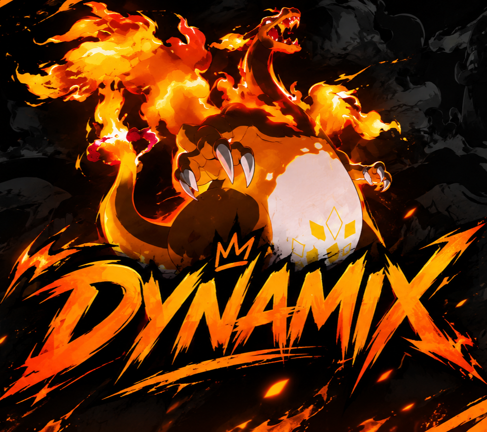

# MTZ Team

> Site da MTZ Team — ferramentas e produtos para Free Fire.

## 🖥️ Sobre

A **MTZ Team** é uma equipe especializada em ferramentas para Free Fire, oferecendo produtos gratuitos e futuramente outros produtos para diferentes necessidades.

O site possui um design moderno com as cores **preto, vermelho e laranja**, além de ser totalmente responsivo para **PC, tablet e mobile**.

## 🛒 Produtos atuais

### 🔥 Painel Dynamax



**Nome:** Painel Dynamax
**Tipo:** Painel Externo
**Versão:** 1.0
**Preço:** Gratuito

Um painel para Free Fire, disponível gratuitamente através da MTZ Team.

A imagem acima utiliza a mesma imagem `painelf1.png` apresentada no site.

## 🔜 Próximos produtos

Estamos trabalhando em novos produtos para a MTZ Team.

### Em desenvolvimento:

* ⚙️ **Regedit**
* 🖥️ **Painel Interno**
* 🖥️ **Painel Externo**
* 🌐 **Proxys**

Os produtos serão adicionados à loja conforme forem finalizados e disponibilizados.

## 📱 Compatibilidade

O site foi desenvolvido para se adaptar automaticamente a diferentes dispositivos:

* 📱 Mobile
* 📲 Tablet
* 🖥️ PC

O layout, menu de navegação e cards dos produtos são adaptados de acordo com o tamanho da tela.

## 🎨 Identidade visual

**Cores:**

* Preto
* Vermelho
* Laranja

**Fontes:**

* Finger Paint
* Inter

## 📁 Estrutura

```text
MTZ-Team/
├── mtz_team.html
├── README.md
└── painelf1.png
```


## 📌 Status do projeto

**Site:** Versão 1.0

**Produto disponível:**

* Painel Dynamax — Gratuito

**Próximos produtos:**

* Regedit
* Painel Interno
* Painel Externo
* Proxys

---

© 2026 MTZ Team. Todos os direitos reservados.
